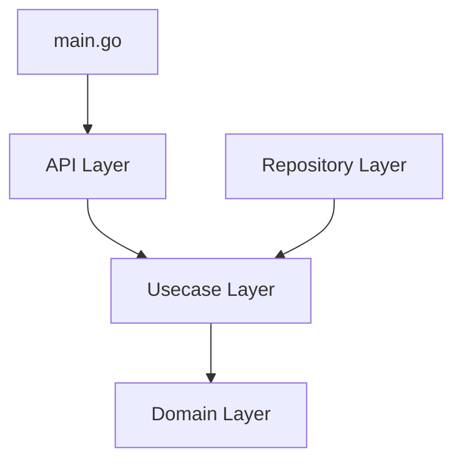

# Note App

This is a note-taking application developed using Go for the backend and Angular for the frontend, following an Iterative and Incremental Development (IID) approach with Test-Driven Development (TDD). The development process is collaboratively copilot-driven with an LLM (Gemini).

## Problem Statement

The project aims to develop a comprehensive note-taking application enabling users to create, organize, and share notes. Key features include managing note titles and diverse content types (text, pictures), tagging notes with user-specific keywords for efficient searching, and robust real-time collaboration with concurrent editing capabilities. The application will support note sharing with granular permissions, multi-device synchronization for all user data, and secure API interactions to ensure data integrity and user access control.

## How to Run the Project

To get the Note App running locally, follow these steps for both the backend (Go) and frontend (Angular).

### Backend

Currently, the backend uses an in-memory repository for data persistence, meaning all data is lost when the application restarts. The plan is to integrate PostgreSQL as the primary database in the future.

1.  **Navigate to the backend directory:**
    ```bash
    cd backend
    ```
2.  **Run the Go application:**
    ```bash
    go run cmd/server/main.go
    ```
    The backend server will start, typically listening on `http://localhost:8080`.

### Frontend

1.  **Navigate to the frontend directory:**
    ```bash
    cd frontend
    ```
2.  **Install dependencies (if you haven't already):**
    ```bash
    npm install
    ```
3.  **Start the Angular development server:**
    ```bash
    npm start
    ```
    The frontend application will compile and open in your browser, usually at `http://localhost:4200`.

## Backend Architecture

The backend follows a layered architecture, often referred to as Clean Architecture or Onion Architecture. This separates concerns and makes the application more modular, testable, and maintainable.

### Architecture Diagram



### Layer Descriptions

-   **`cmd/server/main.go`**: The main entry point of the application. It initializes and wires up all the components, such as the database connection, repositories, use cases, and API handlers, and then starts the HTTP server.
-   **API Layer (`internal/api`)**: This layer is responsible for handling HTTP requests and responses. It receives requests, calls the appropriate use case to handle the business logic, and then formats the response. It is the outermost layer of the application logic.
-   **Usecase Layer (`internal/usecase`)**: This layer contains the core business logic of the application. It orchestrates the flow of data between the API layer and the repository layer. It is not concerned with the details of HTTP or database interactions.
-   **Repository Layer (`internal/repository`)**: This layer is responsible for all data persistence. It defines interfaces for accessing data, and the implementations of these interfaces interact with the database. This isolates the business logic from the specific database technology being used.
-   **Domain Layer (`internal/domain`)**: This is the core of the application. It contains the fundamental business models and logic that are independent of any other layer. All other layers depend on the domain layer, but the domain layer depends on nothing.

## Concurrency

### The Problem

In a collaborative note-taking application, multiple users can view and edit the same note simultaneously. This introduces a concurrency problem: how to manage simultaneous edits to prevent data loss and ensure all users see a consistent version of the note. For example, if two users edit the same content block at the same time, the system must decide which change to accept and how to notify the other user of the update.

### The Solution

We have chosen to treat `Note` and `Content` as separate aggregates, each with its own version number for optimistic locking. A `Note` holds a list of `Content` IDs, and each `Content` has a reference to its parent `Note`.

-   **Optimistic Locking**: Both `Note` and `Content` entities have a `Version` field. When a user updates a `Note` or `Content`, they must provide the version number they last saw. The update succeeds only if the version in the database matches the provided version. If not, it means another user has modified the data in the meantime, and the update is rejected with a conflict error.
-   **Granular Updates**: Changes to a `Content` block only affect that specific `Content` aggregate, triggering a `Content`-level event. Adding or removing a `Content` block, however, modifies the `Note`'s list of content IDs, triggering a `Note`-level event.
-   **Client-Side Handling**: The client receives real-time events for updates. In case of a version conflict, the client is responsible for handling it, for example, by stashing the local changes and applying the latest version from the server.

### Pros and Cons

#### Pros:

-   **High Concurrency**: By treating `Content` as a separate aggregate, we allow multiple users to edit different content blocks within the same note simultaneously without causing conflicts. This improves the user experience in a collaborative environment.
-   **Granular Control**: The use of separate aggregates and optimistic locking provides fine-grained control over data consistency.
-   **Reduced Lock Contention**: Optimistic locking avoids the need for pessimistic locks, which can be a bottleneck in a high-concurrency system.

#### Cons:

-   **Increased Complexity**: This approach adds complexity to both the backend and the client. The backend needs to manage two separate aggregates and their relationships, while the client needs to handle real-time events and potential conflicts.
-   **Potential for Stale Data**: If the client is not properly synchronized with the server, it may display stale data. The client-side logic for handling conflicts and merging changes can be challenging to implement correctly.

## Testing

The project follows a Test-Driven Development (TDD) approach, ensuring that the codebase is well-tested and reliable. Test files are co-located with the source code and are named with a `_test.go` suffix.

### Types of Tests

-   **Unit Tests**: These tests focus on individual components in isolation, such as domain models and mappers. Examples include `note_test.go` and `keyword_test.go`.
-   **Integration Tests**: These tests verify the interaction between different components, such as the use case and repository layers. Examples include `note_usecase_test.go` and `in_memory_note_repository_test.go`.
-   **Functional Tests**: These tests validate the application's functionality from the user's perspective by testing the API endpoints. An example is `note_handler_test.go`.
-   **Concurrency Tests**: These tests specifically target the real-time collaboration features, ensuring that the system can handle simultaneous edits and prevent data corruption. Examples include `note_broadcast_test.go` and tests for optimistic locking in the repository layer.

### Running the Tests

To run all the backend tests, navigate to the `backend` directory and use the following command:

```bash
cd ./backend && go test ./...
```

## AI Collaboration and Context

This project is developed in collaboration with an AI copilot (Gemini). To ensure the AI has the necessary context to understand the project's goals, architecture, and development process, a set of Markdown files are used.

-   **`GEMINI.md`**: This is the master context file that the AI reads at the beginning of each session. It imports other, more specific context files from the `docs` directory.
-   **`docs/*.md`**: This directory contains files that define the project's technology stack, architecture, and the development methodology we follow, such as Iterative and Incremental Development (IID) and Test-Driven Development (TDD).

### The `FEATURES.md` File

The most important of these context files is `docs/FEATURES.md`. This file is the single source of truth for the project's requirements and progress. It is a dynamic document that contains:

-   **Problem Statement**: A detailed description of the problem the application is intended to solve.
-   **Feature Checklist**: A list of all the features to be implemented, broken down into smaller, manageable tasks.
-   **Progress Tracking**: The checklist is updated as features and tasks are completed, providing a clear overview of the project's status.

By maintaining this file, we ensure that both the human developers and the AI copilot have a shared understanding of the project's goals and can work together effectively.
